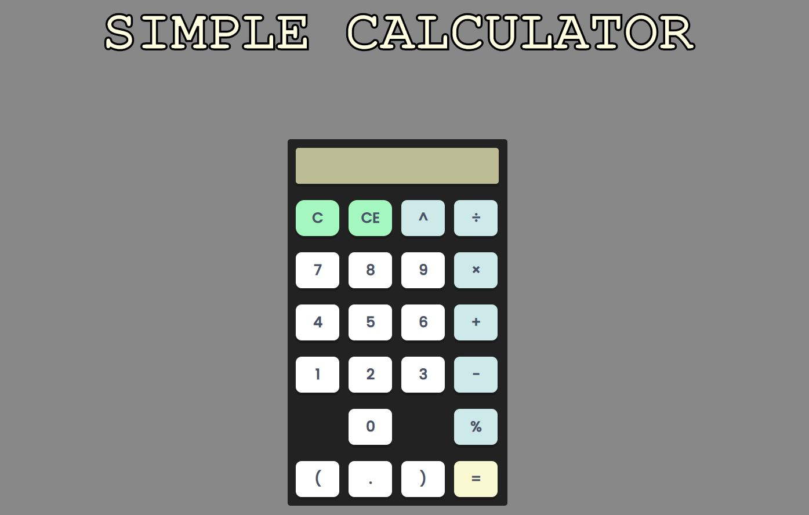
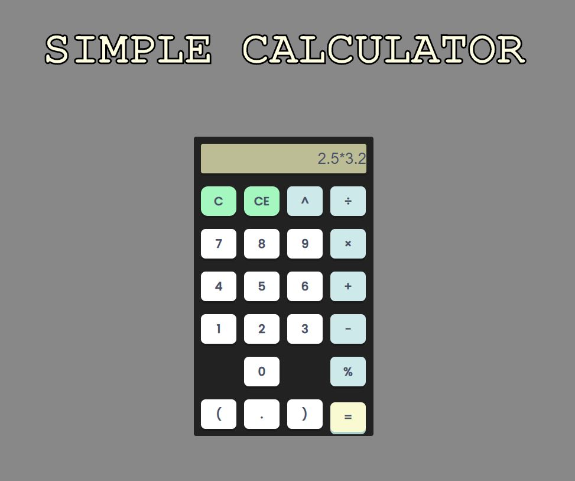

# Calculator-JS

A simple calculator implemented using HTML, CSS and basic Javascript.

# Functionalities
* Basic math operations like addition, subtraction, multiplication, division, modulus and exponentiation.
* Inputs directly from key-press for numbers(numpad-only) and operators. 

# How to run
  * Download the entire repository after forking/cloning
  * Open the `index.html` 
  :thumbsup:
